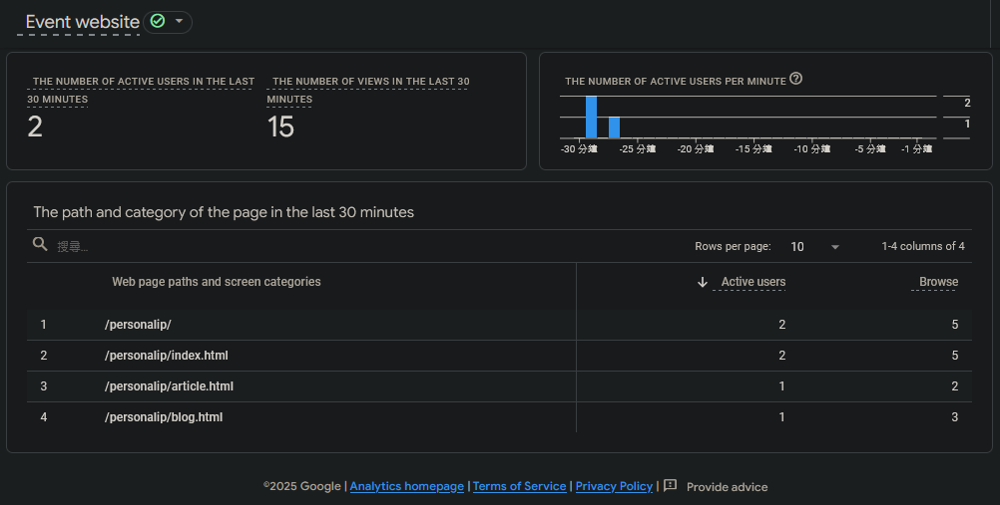

🔄 English Version | [Traditional Chinese Version](README.md)

# 🎯 Final Mission - Personal Brand Website


👉 [Visit the Website](https://kochang66.github.io/personalip/)

🎈 This project is the final assignment for the **Hex School 2025 - 30-Day Frontend Bootcamp**, aimed at creating a responsive personal brand website with three RWD pages and integration with an analytics service. ✨

---

## 🔧 Technologies & Tools Used

| Category | Technologies |
|----------|--------------|
| Frontend | HTML, CSS3 (handwritten), JavaScript |
| Responsive Design | CSS Media Queries |
| Icon Library | Bootstrap Icons |
| Animation | AOS.js |
| Web Font | Google Fonts - Noto Sans TC (Source Han Sans - Traditional Chinese) |
| Service Integration | Google Analytics 4 (GA4) |

---

## 🧱 Website Structure

- `index.html`: Homepage, includes hero section, about, services, blog, case studies, newsletter, and contact sections.
- `blog.html`: Blog listing page with article cards, search bar, and pagination controls.
- `article.html`: Single article page showing the title, date, main image, article content, and navigation to "Previous", "Next", and "Back to Blog".

---

## 🖥️ Responsive Breakpoints

- `>= 1296px`: Desktop view (3-column layout)
- `992px ~ 1295px`: Tablet landscape (2-column layout)
- `767px ~ 991px`: Tablet portrait (2-column layout)
- `< 767px`: Mobile view (single-column layout)

---

## 📈 Analytics Integration

- Integrated with [Google Analytics 4 (GA4)](https://analytics.google.com/) to track website traffic and verify data reception.

```html
<!-- Google tag (gtag.js) Setup -->
<script async src="https://www.googletagmanager.com/gtag/js?id=G-XXXXXXXXXX"></script>
<script>
  window.dataLayer = window.dataLayer || [];
  function gtag(){dataLayer.push(arguments);}
  gtag('js', new Date());
  gtag('config', 'G-XXXXXXXXXX');
</script>
```



---

## 📝 Submission Info

- Assignment Level: LV3 (All RWD pages completed + integrated a service)
- GitHub Repo: [`https://github.com/kochang66/personalip`](https://github.com/kochang66/personalip)
- GitHub Pages: [`https://kochang66.github.io/personalip/`](https://kochang66.github.io/personalip/)

---

## 💡 Notes

- This website was built based on the 🎨 [Hex School Figma Design File](https://www.figma.com/design/bBHUp0TeM0yjAlkjtyxQJI/2025ver.-%E9%AB%94%E9%A9%97%E7%87%9F%E5%AD%B8%E7%94%9F%E8%A8%AD%E8%A8%88%E7%A8%BF?node-id=236-1109), with custom layout optimizations and styling enhancements.

---

## ⚠️ Caution

- **Do not use `overflow-x: hidden` to fix horizontal scrolling issues**
- All layouts conform to responsive web design (RWD) best practices
